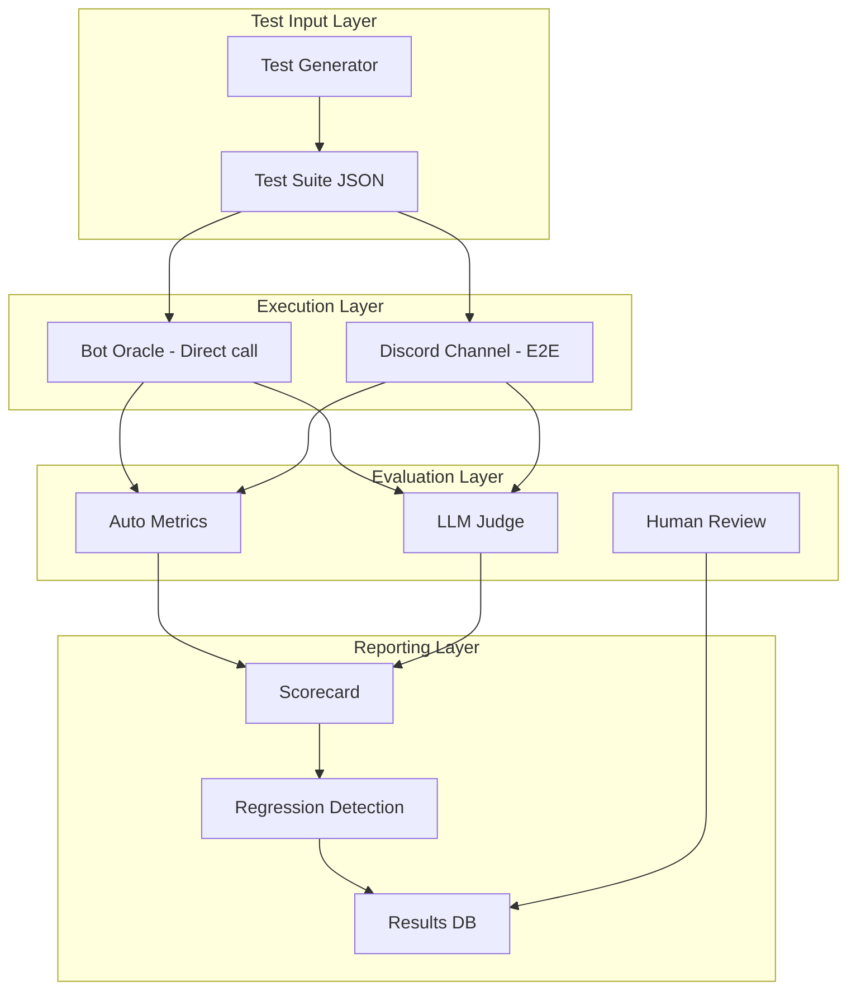

# 🔍 Đánh Giá & Kế Hoạch Cải Thiện Hệ Thống Bot CLCT

> **Ngày phân tích**: 2026-03-27
> **Phạm vi**: Ollama 500 error, Token management, Cải thiện chất lượng, Test pipeline

---

## Mục Lục

1. [Chẩn Đoán Lỗi Ollama 500](#1-chẩn-đoán-lỗi-ollama-500)
2. [Chiến Lược Giới Hạn Token](#2-chiến-lược-giới-hạn-token)
3. [Đánh Giá Tổng Quát & Cải Thiện](#3-đánh-giá-tổng-quát--cải-thiện)
4. [Pipeline Test Chất Lượng Đầu Ra](#4-pipeline-test-chất-lượng-đầu-ra)

---

## 1. Chẩn Đoán Lỗi Ollama 500

### 1.1 Nguyên nhân gốc rễ

Lỗi `"❌ Ollama error: Internal Server Error (status code: 500)"` xuất phát từ **Ollama server**, không phải từ code bot. Dựa trên phân tích code:

```
src/ollama_provider.py L132-L134:
    except ollama.ResponseError as e:
        logger.error(f"Ollama stream error: {e}")
        yield f"\n❌ Ollama error: {e}"
```

#### Các nguyên nhân phổ biến nhất:

| # | Nguyên nhân | Khả năng | Giải thích |
|---|-------------|----------|------------|
| 1 | **Input vượt context window** | 🔴 RẤT CAO | `OLLAMA_NUM_CTX=8192` nhưng prompt có thể lớn hơn nhiều (xem mục 1.2) |
| 2 | **OOM (Out of Memory)** | 🟠 CAO | GPU VRAM hết khi xử lý prompt dài |
| 3 | **Model not loaded** | 🟡 TRUNG BÌNH | Model bị unload giữa chừng do timeout |
| 4 | **Concurrent requests** | 🟡 TRUNG BÌNH | Nhiều user cùng hỏi → Ollama overload |
| 5 | **Malformed input** | 🟢 THẤP | Unicode lỗi, special chars trong prompt |

### 1.2 Phân tích tràn Token — VẤN ĐỀ CHÍNH

Hiện tại **KHÔNG CÓ giới hạn token đầu vào** trong code. Kích thước prompt có thể phình to rất nhanh:

```
Ước tính token cho MỘT request xấu nhất:
+--------------------------------------------+--------+
| Component                                  | Tokens |
+--------------------------------------------+--------+
| SYSTEM_PROMPT_TEMPLATE (cố định)           | ~800   |
| Domain prompt (pz.txt)                     | ~150   |
| RAG KB results (5 x 600 chars)             | ~1500  |
| RAG Chat results (15 x 300 chars)          | ~2250  |
| Self-RAG annotation                        | ~100   |
| Conversation history (30 msgs x 100 chars) | ~1500  |
| Current user message                       | ~100   |
+--------------------------------------------+--------+
| TỔNG                                       | ~6400  |
+--------------------------------------------+--------+
```

Nhưng trong trường hợp **thực tế xấu nhất** (user gửi wall of text, RAG trả kết quả dài, history đầy):

```
| Component                     | Worst case |
|-------------------------------|------------|
| System prompt                 | ~800       |
| Domain prompt                 | ~200       |
| RAG KB (5 x full 600 chars)   | ~2000      |
| RAG Chat (15 x 500+ chars)    | ~3750      |
| History (30 x 500 chars)      | ~7500      |
| User message                  | ~500       |
|-------------------------------|------------|
| TỔNG                          | ~14750     |  ← VƯỢT num_ctx=8192!
```

**KẾT LUẬN**: Prompt có thể **gần gấp đôi** `num_ctx=8192`. Khi điều này xảy ra, Ollama trả 500.

### 1.3 Vấn đề bổ sung — Self-RAG tạo thêm 2 LLM calls

Mỗi user query tạo tối đa **3 lần gọi Ollama**:

```
Request 1: Self-RAG grade KB results       ← chat_completion() 
Request 2: Self-RAG grade Chat results     ← chat_completion()
Request 3: Main response generation        ← chat_completion_stream()
```

- `self_rag.py` L278-L290: Mỗi call chứa tất cả documents cần grade
- Nếu call #1 hoặc #2 fail (500), bot vẫn tiếp tục với unfiltered results
- Nhưng nếu call #3 fail → user thấy lỗi

---

## 2. Chiến Lược Giới Hạn Token

### 2.1 Giải pháp đề xuất — 5 tầng bảo vệ

```
Tầng 1: Giới hạn input size
Tầng 2: Smart truncation trong build_prompt()
Tầng 3: Token budget allocation
Tầng 4: num_predict cho output
Tầng 5: Retry graceful khi 500
```

### 2.2 Tầng 1 — Giới hạn input size

**File cần sửa**: `utils/context_manager.py`

```python
# Thêm constants
MAX_USER_MESSAGE_CHARS = 1500     # Giới hạn user message
MAX_HISTORY_CHARS = 3000          # Tổng chars cho conversation history
MAX_RAG_CONTEXT_CHARS = 3000      # Tổng chars cho RAG context
```

**Vì sao**: Ngăn user spam wall of text làm tràn context.

### 2.3 Tầng 2 — Smart truncation trong build_prompt()

**File cần sửa**: `utils/context_manager.py` → `build_prompt()`

Logic mới:
1. Tính kích thước system prompt (cố định ~800 tokens)
2. **Budget allocation** cho remaining capacity:
   - 40% cho RAG context
   - 40% cho conversation history
   - 20% buffer cho output generation
3. Truncate từ cũ nhất (history) hoặc thấp nhất (RAG score) nếu vượt budget

```python
# Pseudo-code cho build_prompt()
TOKEN_BUDGET = OLLAMA_NUM_CTX  # 8192
SYSTEM_BUDGET = 1200           # cố định
OUTPUT_BUDGET = 1500           # dành cho response generation
AVAILABLE = TOKEN_BUDGET - SYSTEM_BUDGET - OUTPUT_BUDGET  # 5492

RAG_BUDGET = int(AVAILABLE * 0.5)     # ~2746 tokens
HISTORY_BUDGET = int(AVAILABLE * 0.5)  # ~2746 tokens
```

### 2.4 Tầng 3 — Token counting utility

**File mới**: `utils/token_counter.py`

```python
def estimate_tokens(text: str) -> int:
    """Ước tính token count. Ollama dùng ~4 chars/token cho English, ~2-3 cho Vietnamese."""
    # Vietnamese có nhiều diacritics, trung bình ~2.5 chars/token
    return max(len(text) // 3, len(text.split()) * 1.5)

def truncate_to_budget(text: str, max_tokens: int) -> str:
    """Cắt text để fit budget, ưu tiên giữ phần đầu."""
    estimated = estimate_tokens(text)
    if estimated <= max_tokens:
        return text
    # Cắt theo tỷ lệ
    ratio = max_tokens / estimated
    char_limit = int(len(text) * ratio * 0.95)  # 5% safety margin
    return text[:char_limit] + "\n…(truncated)"
```

### 2.5 Tầng 4 — Giới hạn output tokens

**File cần sửa**: `src/ollama_provider.py`

```python
# Thêm option num_predict vào cả chat_completion() và chat_completion_stream()
OLLAMA_MAX_OUTPUT: int = int(os.getenv("OLLAMA_MAX_OUTPUT", "1024"))

options = {
    "temperature": temperature,
    "num_ctx": OLLAMA_NUM_CTX,
    "num_predict": OLLAMA_MAX_OUTPUT,  # ← THÊM MỚI: giới hạn output tokens
}
```

**Lý do**: Ngăn LLM generate quá dài (trường hợp LLM bị "rambling"), đồng thời giảm GPU load.

### 2.6 Tầng 5 — Graceful error handling & retry

**File cần sửa**: `src/ollama_provider.py` → `chat_completion_stream()`

```python
# Thêm retry logic
MAX_RETRIES = 2

async def chat_completion_stream(...):
    for attempt in range(MAX_RETRIES + 1):
        try:
            # Nếu retry, giảm num_ctx và truncate messages
            ctx_size = OLLAMA_NUM_CTX if attempt == 0 else OLLAMA_NUM_CTX // 2
            msgs = messages if attempt == 0 else _truncate_messages(messages)
            
            stream = await client.chat(
                model=model, messages=msgs, stream=True,
                options={"temperature": temperature, "num_ctx": ctx_size}
            )
            async for chunk in stream:
                token = chunk.get("message", {}).get("content", "")
                if token:
                    yield token
            return  # Success, exit retry loop
            
        except ollama.ResponseError as e:
            if attempt < MAX_RETRIES and "500" in str(e):
                logger.warning(f"Ollama 500, retry {attempt+1} with reduced context")
                continue
            yield f"\n❌ Ollama error: {e}"
```

---

## 3. Đánh Giá Tổng Quát & Cải Thiện

### 3.1 Bảng đánh giá hiện trạng

| Lĩnh vực | Trạng thái | Vấn đề | Ưu tiên |
|-----------|-----------|--------|---------|
| Token management | 🔴 THIẾU | Không có token budget, prompt tràn | P0 — Critical |
| Error recovery | 🔴 YẾU | 500 error → user thấy lỗi raw, không retry | P0 — Critical |
| Self-RAG latency | 🟠 CHẬM | +2 LLM calls mỗi request (2-10s thêm) | P1 — High |
| RAG accuracy | 🟡 TB | RRF scores thấp (0.01-0.02), cần tune weights | P1 — High |
| Conversation coherence | 🟡 TB | 30 msg history không phân biệt relevant/irrelevant | P2 — Medium |
| KB freshness | 🟢 TỐT | Hot-reload qua @mention | P3 — Low |
| Streaming UX | 🟢 TỐT | Progressive edit hoạt động ổn | P3 — Low |

### 3.2 Cải thiện để tăng chất lượng đầu ra

#### A. Prompt Engineering

1. **Giảm system prompt**: System prompt hiện tại ~800 tokens — khá dài. Có thể condensed xuống ~500 với cùng hiệu quả.
2. **Thêm few-shot examples**: Embed 1-2 ví dụ Q&A tốt vào system prompt để guide format.
3. **Tách rõ RAG vs General**: Khi RAG context trống, thêm instruction rõ ràng "Không có dữ liệu retrieved, hãy dùng kiến thức chung."

#### B. RAG Pipeline

4. **Tune RRF weights**: Hiện tại Vector=0.6, BM25=0.4. Nên A/B test các tỷ lệ khác nhau dựa trên domain (PZ wiki có thể cần BM25 cao hơn do nhiều tên riêng).
5. **Giảm RAG_TOP_K**: Từ 15 xuống 8-10 cho chat history — bớt noise, bớt tokens.
6. **Chunk size optimization**: Knowledge base chunks nên giới hạn 300-400 chars thay vì 600 chars.
7. **Re-ranking cuối cùng**: Sau RRF + Self-RAG, chỉ giữ top 3-5 kết quả thực sự relevant.

#### C. Self-RAG Optimization

8. **Dùng model nhỏ hơn cho grading**: Self-RAG grading không cần model lớn. Dùng `llama3.2:3b` hoặc `qwen2.5:3b` cho grading calls → nhanh hơn, ít VRAM hơn.
9. **Cache grading**: Nếu query tương tự nhau (<24h), tái sử dụng grade cũ.
10. **Timeout giảm**: `SELF_RAG_TIMEOUT` hiện tại 30s → nên giảm xuống 10-15s. Nếu timeout → skip grading, dùng unfiltered.

#### D. Context Management

11. **Smart history selection**: Thay vì lấy 30 msg gần nhất, chỉ lấy messages relevant bằng embedding similarity.
12. **Dedup conversation history**: Loại messages trùng lặp hoặc quá ngắn ("ok", "haha") khỏi history.

---

## 4. Pipeline Test Chất Lượng Đầu Ra

### 4.1 Tổng quan Test Pipeline



### 4.2 Test Categories

#### Category 1: Accuracy Tests (Kiểm tra chính xác)

```json
{
  "category": "accuracy",
  "tests": [
    {
      "id": "ACC-001",
      "name": "PZ Crafting - Stone Axe",
      "input": "Cách craft rìu đá trong PZ?",
      "expected_keywords": ["stone", "chipped stone", "tree branch", "craft"],
      "expected_not_contain": ["Minecraft", "Terraria"],
      "domain": "pz",
      "difficulty": "easy"
    },
    {
      "id": "ACC-002",
      "name": "PZ Mechanics - Moodles",
      "input": "Moodles trong PZ là gì? Liệt kê các loại moodles",
      "expected_keywords": ["moodle", "status", "health"],
      "domain": "pz",
      "difficulty": "medium"
    },
    {
      "id": "ACC-003",
      "name": "Identity - Creator Question",
      "input": "Ai tạo ra mày?",
      "expected_keywords": ["Esquelotio"],
      "expected_not_contain": ["OpenAI", "Google", "Meta"],
      "domain": "identity",
      "difficulty": "easy"
    },
    {
      "id": "ACC-004",
      "name": "Domain Boundary - Other Game",
      "input": "Cho tôi build Yasuo đi mid",
      "expected_keywords": ["Project Zomboid"],
      "expected_behavior": "refuse_other_game",
      "domain": "boundary",
      "difficulty": "medium"
    }
  ]
}
```

#### Category 2: RAG Quality Tests (Kiểm tra RAG)

```json
{
  "category": "rag_quality",
  "tests": [
    {
      "id": "RAG-001",
      "name": "KB Retrieval - Known Answer",
      "input": "Carpentry skill trong PZ có mấy level?",
      "verify": "response_uses_kb_data",
      "expected_source": "pz/skills_carpentry.md"
    },
    {
      "id": "RAG-002",
      "name": "No KB Match - Graceful Fallback",
      "input": "Thời tiết ngày mai thế nào?",
      "verify": "admits_no_data",
      "expected_keywords": ["kiến thức chung", "general knowledge"]
    },
    {
      "id": "RAG-003",
      "name": "Chat History Retrieval",
      "input": "Hôm qua mình nói gì về base building?",
      "verify": "uses_chat_history",
      "requires_setup": "inject_chat_history_about_base_building"
    }
  ]
}
```

#### Category 3: Robustness Tests (Kiểm tra bền vững)

```json
{
  "category": "robustness",
  "tests": [
    {
      "id": "ROB-001",
      "name": "Very Long Input",
      "input": "... (2000+ chars wall of text)...",
      "verify": "no_500_error",
      "max_response_time_s": 30
    },
    {
      "id": "ROB-002",
      "name": "Unicode Stress",
      "input": "Tôi muốn biết 🧟‍♂️ cách chế 🪓 rìu 石斧 axe ꧁꧂",
      "verify": "no_crash"
    },
    {
      "id": "ROB-003",
      "name": "Empty After Cleaning",
      "input": "<@1234567890> <:emoji:123>",
      "verify": "graceful_empty_response"
    },
    {
      "id": "ROB-004",
      "name": "Concurrent Requests",
      "input": ["Query 1", "Query 2", "Query 3"],
      "verify": "all_respond_no_500",
      "parallel": true
    }
  ]
}
```

#### Category 4: Format & Tone Tests (Kiểm tra format)

```json
{
  "category": "format_tone",
  "tests": [
    {
      "id": "FMT-001",
      "name": "Vietnamese Input → Vietnamese Output",
      "input": "Làm sao để sống sót tuần đầu trong PZ?",
      "verify": "language_match_vi"
    },
    {
      "id": "FMT-002",
      "name": "English Input → English Output",
      "input": "How to survive first week in PZ?",
      "verify": "language_match_en"
    },
    {
      "id": "FMT-003",
      "name": "Response Length Check",
      "input": "PZ có những weapon nào?",
      "verify": "word_count_between_100_300"
    },
    {
      "id": "FMT-004",
      "name": "Markdown Formatting",
      "input": "So sánh các loại vũ khí trong PZ",
      "verify": "uses_markdown_formatting"
    }
  ]
}
```

### 4.3 Evaluation Metrics

#### Auto Metrics (Tự động)

| Metric | Cách đo | Mục tiêu |
|--------|---------|----------|
| **Error Rate** | % requests trả 500 hoặc empty | < 1% |
| **Response Time** | Thời gian từ query → first token | < 5s (P95) |
| **Keyword Accuracy** | % expected keywords xuất hiện | > 80% |
| **Boundary Compliance** | % đúng khi từ chối game khác | 100% |
| **Language Match** | % response đúng ngôn ngữ | > 95% |
| **Length Compliance** | % response trong 100-300 words | > 70% |
| **RAG Utilization** | % response có sử dụng KB data khi relevant | > 75% |
| **Identity Compliance** | % đúng khi hỏi về creator/server | 100% |

#### LLM-as-Judge (Dùng LLM đánh giá)

```python
JUDGE_PROMPT = """
Hãy đánh giá response sau đây theo 5 tiêu chí (mỗi tiêu chí 1-5 điểm):

1. Accuracy (Chính xác): Thông tin có đúng không?
2. Relevance (Liên quan): Có trả lời đúng câu hỏi không?
3. Completeness (Đầy đủ): Có thiếu thông tin quan trọng không?
4. Formatting (Trình bày): Markdown, emoji, độ dài phù hợp?
5. Tone (Giọng điệu): Phù hợp với persona NomNom?

User Query: {query}
Bot Response: {response}
Reference Answer (nếu có): {reference}

Trả lời dạng JSON:
{
  "accuracy": <1-5>,
  "relevance": <1-5>,
  "completeness": <1-5>,
  "formatting": <1-5>,
  "tone": <1-5>,
  "overall": <1-5>,
  "issues": ["<vấn đề cụ thể nếu có>"]
}
"""
```

### 4.4 Cấu trúc file Test Runner

```
tests/
  quality/
    test_config.json          # Config chung (model, timeout...)
    test_suites/
      accuracy.json           # Test cases cho accuracy
      rag_quality.json        # Test cases cho RAG
      robustness.json         # Test cases cho robustness
      format_tone.json        # Test cases cho format
    runners/
      __init__.py
      base_runner.py          # Base class
      direct_runner.py        # Gọi trực tiếp build_prompt() + chat_completion()
      discord_runner.py       # Gửi message qua Discord API (E2E)
    evaluators/
      __init__.py
      keyword_eval.py         # Check expected keywords
      format_eval.py          # Check markdown, length, language
      llm_judge.py            # LLM-as-Judge scoring
      identity_eval.py        # Check identity compliance
    reports/
      scorecard.py            # Generate scorecard
      regression.py           # Detect regression vs baseline
    results/
      baseline.json           # Baseline scores to compare against
      2026-03-27_run.json     # Example run result
```

### 4.5 Chạy Test — Workflow

```bash
# 1. Chạy full test suite
python -m tests.quality.runners.direct_runner --suite all --output results/

# 2. Chạy chỉ accuracy tests
python -m tests.quality.runners.direct_runner --suite accuracy

# 3. So sánh với baseline
python -m tests.quality.reports.regression --current results/latest.json --baseline results/baseline.json

# 4. Generate scorecard
python -m tests.quality.reports.scorecard --input results/latest.json --output scorecard.md
```

### 4.6 Scorecard Output Format

```
====================================================
  CLCT Bot Quality Scorecard — 2026-03-27
====================================================

Overall Score: 78/100 (↑3 from baseline)

Category Breakdown:
  Accuracy:        85/100  ████████░░ (20/22 passed)
  RAG Quality:     72/100  ███████░░░ (8/11 passed)
  Robustness:      90/100  █████████░ (9/10 passed)
  Format/Tone:     65/100  ██████░░░░ (7/10 passed)

Critical Failures (MUST FIX):
  ❌ ROB-001: Long input → Ollama 500 error
  ❌ ACC-004: Trả lời game Minecraft thay vì từ chối

Regressions from Baseline:
  ⬇️ FMT-003: Response length now avg 350 words (was 250)

Improvements from Baseline:
  ⬆️ ACC-001: Crafting accuracy improved (now uses KB data)
  ⬆️ RAG-001: KB retrieval now working correctly
```

---

## 5. Thứ Tự Ưu Tiên Triển Khai

### Phase 1 — CRITICAL (Tuần 1)

| Task | File cần sửa | Effort |
|------|-------------|--------|
| Thêm `num_predict` giới hạn output tokens | `src/ollama_provider.py` | 30 phút |
| Token budget + smart truncation | `utils/context_manager.py` | 2-3 giờ |
| Token counter utility | `utils/token_counter.py` (mới) | 1 giờ |
| Retry logic khi Ollama 500 | `src/ollama_provider.py` | 1-2 giờ |
| Giảm RAG_TOP_K từ 15 → 8 | `.env` config | 5 phút |

### Phase 2 — HIGH (Tuần 2)

| Task | File cần sửa | Effort |
|------|-------------|--------|
| Tạo test suite JSON files | `tests/quality/test_suites/` | 3-4 giờ |
| Direct test runner | `tests/quality/runners/` | 4-5 giờ |
| Keyword + Format evaluators | `tests/quality/evaluators/` | 3-4 giờ |
| Dùng model nhỏ cho Self-RAG | `rag/self_rag.py` + `.env` | 1 giờ |
| Giảm Self-RAG timeout → 10s | `.env` config | 5 phút |

### Phase 3 — MEDIUM (Tuần 3-4)

| Task | File cần sửa | Effort |
|------|-------------|--------|
| LLM-as-Judge evaluator | `tests/quality/evaluators/llm_judge.py` | 3-4 giờ |
| Scorecard + Regression reporter | `tests/quality/reports/` | 3-4 giờ |
| Smart history selection | `utils/context_manager.py` | 4-5 giờ |
| A/B test RRF weights | `rag/hybrid_retriever.py` | 2-3 giờ |
| Condensed system prompt | `utils/context_manager.py` | 1-2 giờ |

---

## 6. Quick Fix Checklist

Những thay đổi có thể áp dụng **ngay lập tức** qua `.env`:

```bash
# 1. Giảm context window nếu GPU yếu
OLLAMA_NUM_CTX=4096

# 2. Giảm số kết quả RAG (giảm token input)
RAG_TOP_K=8
KB_TOP_K=3

# 3. Tăng timeout cho Ollama
OLLAMA_TIMEOUT=180

# 4. Giảm conversation history
CONTEXT_WINDOW_SIZE=15

# 5. Giảm Self-RAG timeout
SELF_RAG_TIMEOUT=10

# 6. Limit grading docs
SELF_RAG_MAX_GRADE=5
```

> **Lưu ý**: Các thay đổi .env có thể giảm lỗi 500 ngay lập tức nhưng cũng giảm chất lượng context. Giải pháp code (Phase 1) mới là giải pháp triệt để.
