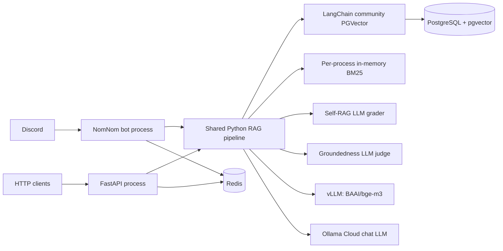

# NomNom Architecture History and Frozen Baseline

Recorded: 2026-07-10 (Asia/Bangkok)

This document freezes the architectures known before the RAG remediation that
starts after this record. It deliberately contains no credentials, user
messages, or raw Discord exports.

## A. Legacy dual-bot architecture (historical)

Source of record: `docs/audit/legacy/tongquan.md` (analysis dated
2026-03-19).

Two independent implementations coexisted:

1. **CLCT / NomNom active bot**: `main.py` -> `src/bot.py` ->
   `src/aclient.py`, Ollama chat, LangChain community PGVector,
   PostgreSQL/pgvector, local Ollama `nomic-embed-text` embeddings, a
   per-channel in-memory context window, and static multi-domain markdown KB.
2. **LlamaIndex legacy bot**: `discord_bot.py` + `llm_provider.py`, with a
   local LlamaIndex `VectorStoreIndex` and selectable Hugging Face/OpenAI
   embeddings. It is retained for compatibility, not the production request
   path.

The old active RAG had vector-only KB/chat retrieval and a threshold fallback;
it had no trust-gated answer/clarify/abstain decision or post-generation
groundedness stage.

## B. Current hybrid/trust-gated architecture (frozen as-is)

This is the runtime architecture immediately before the new local-first
remediation.

### Request path

1. `QueryPreprocessor` removes Discord markup, expands abbreviations, adds a
   keyword-selected domain prefix and optional Vietnamese-to-English terms.
2. Keyword/regex intent routing may classify a short unmatched query as
   `conversation`, skipping RAG.
3. KB and approved-chat candidates are searched through vector and BM25 arms,
   then joined with Reciprocal Rank Fusion.
4. KB and chat candidate sets are independently Self-RAG graded.
5. `EvidencePolicy` uses a composite confidence to choose `answer`,
   `clarify`, or `abstain`.
6. An answer is generated with the chat model, then a second model call checks
   groundedness and may replace it with a canned abstention.

### Frozen configuration

The active local configuration at audit time used:

| Area | Setting |
|---|---|
| Chat provider | Ollama Cloud |
| Embedding provider | local vLLM, `BAAI/bge-m3`, 1024 dimensions |
| Retrieval | hybrid RRF, vector threshold 0.30 / KB threshold 0.35 |
| Candidate pools | chat 20+20->25; KB 30+40->40 |
| Prompt cap | chat 5; KB 7 |
| Self-RAG | enabled, batch, up to 20 docs, 30 s timeout |
| Evidence | answer >= 0.55, clarify >= 0.35 |
| Groundedness | enabled, score >= 0.60, 20 s timeout; timeout fail-closed |
| Trust | KB domains `pz,server_rules`; chat must be approved |

### Frozen runtime/data baseline

Observed from the running local Docker stack:

| Signal | Value |
|---|---:|
| `rag_metrics` rows | 34 |
| Empty retrieval rows | 26 |
| Approved chat sources | 0 |
| Active KB domains in DB | 1 (`pz`) |
| KB rows / unique content | 154,531 / 11,887 |
| PostgreSQL size | 973 MB |
| API + bot resident memory | about 2.1 GiB |
| vLLM embedding resident memory | about 3.36 GiB |
| PostgreSQL resident memory | about 1.1 GiB |
| vLLM image size | about 29.9 GB |

The API and bot logs reported `Knowledge base loaded: 0 chunks across 3
domains` after an embedding connection error. The router only considers
in-memory loaded domains, so this failure prevented normal KB lookup even
though an old KB collection remained in PostgreSQL.

### Frozen quality baseline

* All seven answerable seed questions missed their expected source in the top
  200 vector results.
* The same text embedded through the raw vLLM client versus the old LangChain
  `OpenAIEmbeddings` path had cosine similarity `0.2401`; the old stored
  vectors matched the old LangChain path at `1.0`. This identifies incorrect
  OpenAI-tokenizer preprocessing for BGE-M3 as the primary vector-quality
  fault.
* A fixed LangChain configuration (`tiktoken_enabled=False`,
  `check_embedding_ctx_length=False`) matches raw vLLM embedding at cosine
  `1.0`.
* `python -m pytest -q` passed 347 tests. The suite did not contain a live
  raw-text embedding parity test or corpus-level retrieval regression test.
* The release dataset contains 20 rows, not the required 300. Its current
  aggregate retrieval calculation averages answerable and non-answerable rows,
  therefore even perfect retrieval is capped at 0.35 while the gate expects
  Recall@5 >= 0.92.

## C. Deployment architecture before remediation

Docker Compose starts PostgreSQL, Redis, vLLM embeddings, FastAPI, and the
Discord bot in one stack. API and bot wait only for the vLLM *container to
start*, not for the embedding endpoint/model to become ready. Each app process
also rebuilds its own in-memory BM25 index on startup. The Docker image copies
the entire build context, including non-runtime workspace data not excluded by
the prior `.dockerignore`.

This layout remains recoverable as the `local-legacy` profile until the new
collection is validated and promoted. The old vector collection must never be
deleted as part of the first reindex.

## D. Change-control rules for the replacement

1. Build a separate, versioned KB collection (`*_v2`) and keep the frozen
   collection read-only.
2. Verify document count, source inventory, embedding parity, and golden
   retrieval before changing the active collection variable.
3. Keep a configuration switch back to `local-legacy` until a human has
   reviewed the new answer set.
4. Record each benchmark with collection, embedding model, input mode, code
   revision, and retrieval configuration.
5. Do not enable a paid embedding provider without an explicit provider/key and
   budget decision. The first replacement profile remains free/local.
