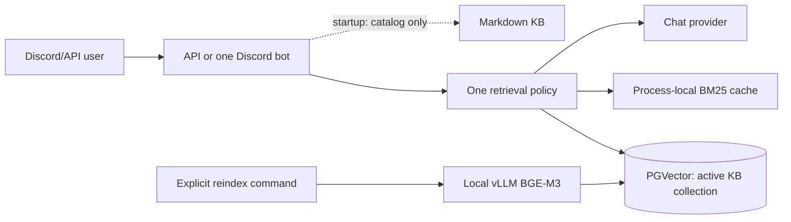
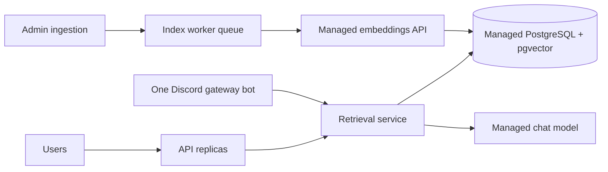

# RAG local-first rollout and paid-scale migration

Date: 2026-07-10 (Asia/Bangkok)  
Status: local v2 promoted and running; paid providers are **not enabled**.

## Rollout result (2026-07-10)

The live Discord bot and FastAPI service now use `clct_knowledge_v2`, embedding
signature `openai_compatible / BAAI/bge-m3 / 1024 / v2 / raw_text_v1`, with
Self-RAG disabled for the local test profile. The old `clct_knowledge`
collection remains available for rollback.

Observed after rollout:

| Check | Result |
|---|---:|
| Candidate KB chunks | 11,887 unique chunks |
| API/Bot KB catalog startup | 165 files; no embedding writes |
| BM25 startup | 11,887 KB chunks in about 0.6 s |
| Live factual API response | `answer`, 2 cited chunks, about 2.76 s cold |
| Same response from Redis | about 0.10 s |
| Runtime image | about 240 MB compressed/inspect size |
| Full automated suite | 355 passed |

The answer finalizer now has two independent controls: a deterministic rule
requiring every substantive factual line to cite an existing `[n]` marker, and
the LLM groundedness check. Groundedness score/reason/errors are persisted for
monitoring. Factual generation uses temperature 0.1 and a maximum three-bullet
evidence-backed format; conversation retains the personality temperature.

The release quota is intentionally still open: the repository contains only
20 seed examples. The required 300-row dataset must be human-authored/reviewed;
synthetically filling this quota would make the release gate meaningless.

Read the frozen pre-change architecture and baseline first:
[`architecture-history-2026-07-10.md`](architecture-history-2026-07-10.md).

## Target architecture for free/local answer testing



Rules in this phase:

1. Startup discovers KB domains and prompts only. It never embeds the corpus.
2. Only `scripts/reindex_vectors.py` writes KB vectors. It requires a new
   collection name and refuses to overwrite the active collection.
3. Local vLLM/BGE-M3 remains the free test embedding path, with raw text
   inputs (not OpenAI tokenizer IDs).
4. A short factual question without a domain keyword is routed to retrieval;
   small talk remains retrieval-free.
5. Self-RAG is disabled in the sample test profile. Citation and groundedness
   evidence remain the hallucination controls; judge failures must be measured.

### Candidate and promotion procedure

1. Apply migrations:

   ```bash
   docker compose run --rm --no-deps nomnom-api python scripts/migrate_db.py
   ```

2. Build a separate candidate (example uses the existing `clct_knowledge`):

   ```bash
   docker compose run --rm --no-deps nomnom-api \
     python scripts/reindex_vectors.py \
     --target-collection clct_knowledge_v2 \
     --collection-version v2 --min-chunks 1000 --confirm REINDEX
   ```

3. Run the fixed golden questions plus a human-reviewed set. Record collection,
   model, input mode, latency, abstain rate, source hit rate, and groundedness.
   Calculate retrieval Recall@k only over answerable questions; measure the
   correct abstention rate separately for unanswerable questions.
4. A reviewer compares candidate answers/citations with the frozen baseline.
   Only then change `KB_COLLECTION=clct_knowledge_v2` and
   `EMBEDDING_COLLECTION_VERSION=v2`, build/restart the application services,
   and monitor. The old collection remains untouched for rollback.

Do not promote from a single success criterion. The release dataset must reach
300 human-reviewed rows before opening to a broad user population. Suggested
initial operational targets are: answerable Recall@5 >= 0.90, citation/source
hit >= 0.95, unsupported-answer rate <= 2%, and no-evidence abstention rate
reported separately rather than mixed into retrieval recall.

## Paid migration when concurrency requires it

Local BGE-M3 is free in API cost but requires an always-on GPU process. The
paid migration removes that operational dependency without changing the
retrieval contract:



1. Choose and approve a managed embedding provider, key storage, rate limit,
   monthly budget, and data-processing policy. For an OpenAI option, use a
   `text-embedding-3-*` model with a fixed configured dimension; its official
   documentation supports dimensionality reduction and batch embedding.
2. Create a *third* collection (for example `clct_knowledge_openai_v3`), with
   a distinct provider/model/dimension/version signature. Never mix vectors
   from providers in one collection.
3. Reindex by a bounded background worker/queue, use retry + idempotent
   `doc_id`, then run exactly the same candidate benchmark and human review.
4. Promote by configuration only after passing the gate. Retain the v2 local
   collection for a defined rollback window.
5. Scale API horizontally behind a load balancer; run exactly one Discord
   gateway bot shard set; run index workers separately from query replicas.
   Move BM25 to a shared service/cache or use PostgreSQL full-text search before
   adding many API replicas, so each replica does not hold its own full corpus.
6. Add pgvector HNSW indexes and metadata filters after candidate correctness
   is stable; benchmark filtered recall and latency before enabling the index.

References: [OpenAI embeddings guide](https://developers.openai.com/api/docs/guides/embeddings),
[OpenAI Batch API guide](https://developers.openai.com/api/docs/guides/batch),
and [pgvector HNSW/filtering documentation](https://github.com/pgvector/pgvector).

## Explicit non-goals for this rollout

* No paid API key is added or sent by this change.
* No existing `clct_knowledge` vector is deleted or mutated.
* The legacy chat-history vectors are not trusted or promoted; reindex them in
  their own reviewed project only if approved chat retrieval is introduced.
