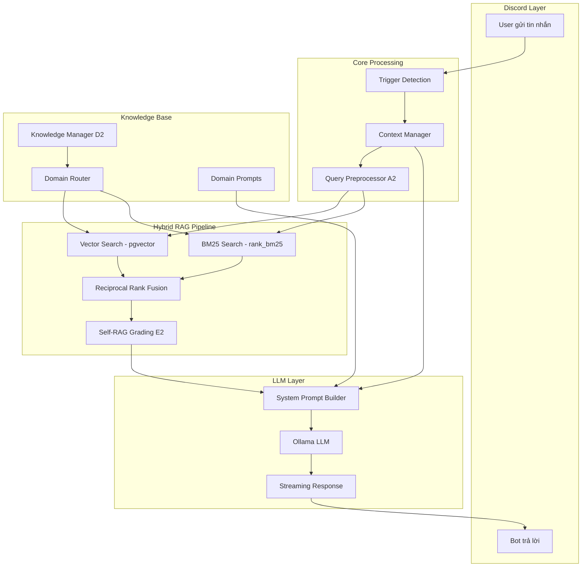
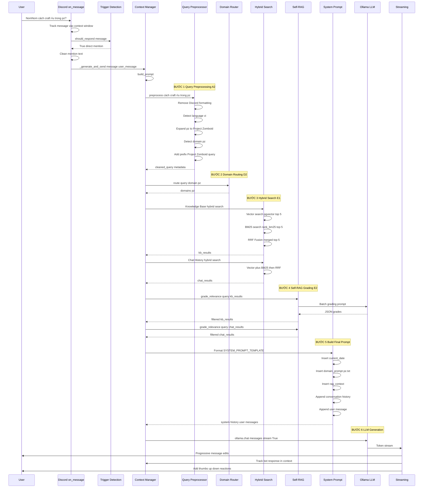
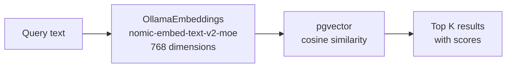
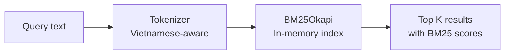
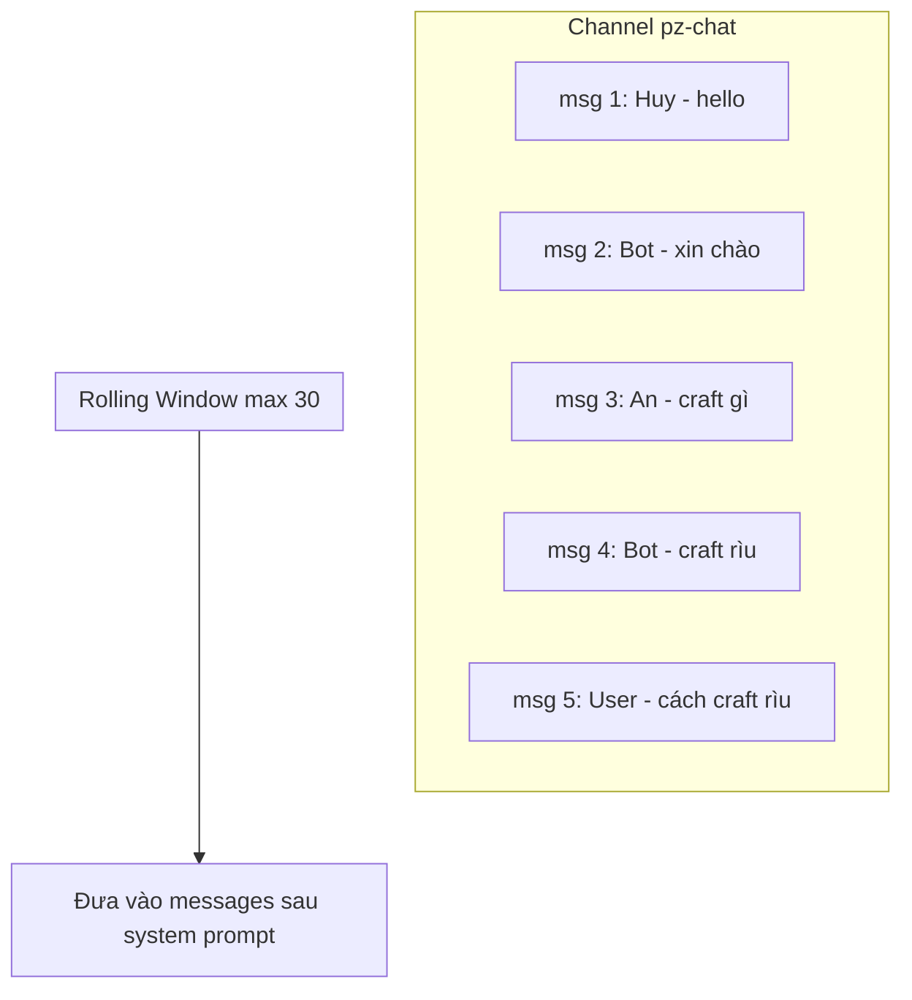
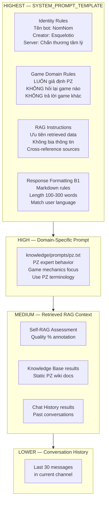

# 🔬 Phân Tích Pipeline Hệ Thống Bot CLCT Discord

> **Phiên bản**: Phân tích dựa trên source code hiện tại (2026-03-27)
> **Bot name**: NomNom (CLCT)
> **Stack**: Python + Discord.py + Ollama + PostgreSQL/pgvector + LangChain

---

## 📑 Mục Lục

1. [Tổng Quan Kiến Trúc](#1-tổng-quan-kiến-trúc)
2. [Pipeline Xử Lý Tin Nhắn — Ví Dụ Cụ Thể](#2-pipeline-xử-lý-tin-nhắn)
3. [Hệ Thống Search & Embedder](#3-hệ-thống-search--embedder)
4. [Bộ Nhớ Ngắn Hạn & Truy Vấn Tin Nhắn Trước](#4-bộ-nhớ-ngắn-hạn--truy-vấn-tin-nhắn-trước)
5. [Thứ Tự Ưu Tiên System Prompt](#5-thứ-tự-ưu-tiên-system-prompt)
6. [Sơ Đồ Tổng Hợp](#6-sơ-đồ-tổng-hợp)

---

## 1. Tổng Quan Kiến Trúc



### Các file chính và vai trò:

| File | Vai trò |
|------|---------|
| `main.py` | Entry point, validate env |
| `src/bot.py` | Event handlers, slash commands |
| `src/aclient.py` | CLCTClient — core logic, trigger detection, response generation |
| `utils/context_manager.py` | Bộ nhớ ngắn hạn, build prompt, SYSTEM_PROMPT_TEMPLATE |
| `rag/retriever.py` | Orchestrator RAG pipeline |
| `rag/hybrid_retriever.py` | Hybrid search (Vector + BM25 + RRF) |
| `rag/bm25_search.py` | BM25 lexical search, tokenizer |
| `rag/self_rag.py` | LLM-based relevance grading |
| `rag/query_preprocessor.py` | Clean query, expand abbreviations |
| `rag/db.py` | PostgreSQL + pgvector layer |
| `rag/embedder.py` | Ollama embedding generation |
| `knowledge/manager.py` | Load, chunk, embed knowledge docs |
| `knowledge/domain_router.py` | Route query → đúng domain |
| `src/ollama_provider.py` | Ollama chat completion + streaming |

---

## 2. Pipeline Xử Lý Tin Nhắn

### 🎯 Ví dụ cụ thể: User hỏi "cách craft rìu trong pz?"



---

### Chi tiết từng bước:

### BƯỚC 1: Trigger Detection & Message Tracking

**Code**: `src/bot.py` L52-L116 + `src/aclient.py` L185-L218

Khi Discord event `on_message` được trigger:

1. **Mọi tin nhắn đều được track** vào `context_manager.track_message()` — kể cả khi bot không respond
2. **Kiểm tra trigger** theo thứ tự ưu tiên:
   - ① Direct `@mention` → respond
   - ② Reply to bot message → respond
   - ③ ReplyAll mode ON → respond
   - ④ Active thread (bot đã tham gia) → respond
   - ⑤ Implicit similarity reply (nếu enable) → respond
3. **Clean message**: Xóa `<@bot_id>` khỏi nội dung
4. **Check KB admin command**: Nếu user gõ "reload knowledge" hoặc "kb status" → xử lý riêng, không đi qua LLM

```python
# src/bot.py L68-L76 — LUÔN track mọi tin nhắn
discordClient.context_manager.track_message(
    channel_id=channel_id,
    message_id=str(message.id),
    author_id=str(message.author.id),
    author_name=str(message.author.display_name),
    content=message.content,
    is_bot=False,
    reply_to_id=reply_to_id,
)
```

### BƯỚC 2: Query Preprocessing (A2)

**Code**: `rag/query_preprocessor.py` L85-L135

Pipeline 6 bước:
1. **Remove Discord formatting**: `<@123>`, `<#channel>`, custom emoji, URLs
2. **Collapse whitespace**: `\s+` → single space
3. **Detect language**: Đếm Vietnamese diacritics → `"vi"` hoặc `"en"`
4. **Expand abbreviations**: `"pz"` → `"Project Zomboid"`, `"ko"` → `"không"`, `"dc"` → `"được"`
5. **Detect domain**: Scan keywords → `"pz"` nếu chứa "zomboid", "crafting", "moodle", etc.
6. **Add domain prefix**: `"Project Zomboid: cách craft rìu..."` — giúp embedding search chính xác hơn

### BƯỚC 3: Hybrid RAG Search (E1)

**Code**: `rag/retriever.py` L271-L439 + `rag/hybrid_retriever.py` L131-L263

Pipeline thực hiện **2 lần hybrid search**:

**Lần 1 — Knowledge Base** (tài liệu tĩnh):
- Domain Router chọn domain `"pz"` → search trong collection `knowledge_base`
- Vector search: pgvector cosine similarity
- BM25 search: exact keyword match ("craft", "rìu", "axe")
- RRF Fusion: merge kết quả

**Lần 2 — Chat History** (lịch sử chat Discord):
- Enrich query với 5 tin nhắn gần nhất: `"query [context: msg1 | msg2 | ...]"`
- Vector search: collection `discord_messages`
- BM25 search: in-memory BM25 index
- RRF Fusion
- A4 Fallback: Nếu 0 kết quả ở threshold=0.3, retry ở threshold=0.2 với top_k=5

### BƯỚC 4: Self-RAG Grading (E2)

**Code**: `rag/self_rag.py` L131-L232

LLM tự đánh giá relevance của từng document trước khi dùng:

1. **Skip check**: Nếu tất cả kết quả có avg similarity >= 0.7 → bỏ qua grading (tiết kiệm LLM call)
2. **Batch grading**: Gửi 1 prompt chứa tất cả documents → LLM trả JSON grades
3. **Filter**: Chỉ giữ `RELEVANT` (>=0.6) và `PARTIALLY_RELEVANT` (0.3-0.6), loại `IRRELEVANT`
4. **Annotation**: Tạo `[Self-RAG Quality Assessment: 80% relevant]` inject vào prompt

```
Ví dụ Self-RAG output:
[Self-RAG Quality Assessment: 80% relevant, 20% partially relevant]
[1 irrelevant documents were filtered out]
```

### BƯỚC 5: Build Final Prompt

**Code**: `utils/context_manager.py` L286-L347

```python
# Cấu trúc messages[] gửi cho Ollama:
messages = [
    {"role": "system", "content": SYSTEM_PROMPT_TEMPLATE.format(
        current_date="2026-03-27 03:39 UTC",
        domain_prompt="# Domain-Specific Instructions\n<nội dung pz.txt>",
        rag_context="""
[Self-RAG Quality Assessment: 80% relevant]
[1 irrelevant documents were filtered out]

[Retrieved Knowledge Base — Relevant static documents]
[KB-1] (78% match) [pz] pz/crafting_axe.md
    Stone Axe: Requires 1 Stone + 1 Tree Branch + ...

[Retrieved Chat History — Relevant past conversations]
[1] (65% match [vector+bm25]) @UserABC — 2026-03-20T...
    Rìu đá craft bằng stone + branch, cần dùng chipped stone...
        """
    )},
    # Conversation history (rolling window, tối đa 30 messages)
    {"role": "user", "content": "@Huy: hôm nay chơi pz ko"},
    {"role": "assistant", "content": "Chơi chứ! Server đang mở..."},
    # Current message
    {"role": "user", "content": "@User: cách craft rìu trong pz?"},
]
```

### BƯỚC 6: LLM Generation & Streaming

**Code**: `src/aclient.py` L506-L564 + `src/ollama_provider.py` L143-L184

1. Gửi "Thinking..." message trước
2. Stream tokens từ Ollama, buffer theo interval 1.5s
3. Edit Discord message mỗi 1.5s (tối đa 30 lần edit)
4. Final edit với response hoàn chỉnh
5. Track bot response vào context window
6. Add 👍👎 reactions cho feedback (B2)

---

## 3. Hệ Thống Search & Embedder

### 3.1 Vector Search (Semantic)

**Code**: `rag/db.py` L241-L284



- **Model**: `nomic-embed-text-v2-moe` (768 dimensions)
- **Storage**: PostgreSQL + pgvector extension
- **2 collections riêng biệt**:
  - `discord_messages` — lịch sử chat
  - `knowledge_base` — tài liệu tĩnh (PZ wiki, rules...)
- **Threshold**: 0.3 (mặc định), fallback xuống 0.2

**Cách hoạt động**:
1. Query text → `OllamaEmbeddings.aembed_query()` → 768-dim vector
2. pgvector thực hiện `cosine_similarity(query_vector, stored_vectors)`
3. Trả về top-K documents sorted by similarity score

### 3.2 BM25 Search (Lexical)

**Code**: `rag/bm25_search.py`



- **Algorithm**: Okapi BM25 via `rank_bm25`
- **Tokenizer**: Vietnamese-aware, loại stopwords (cả tiếng Việt lẫn English), strip Discord noise
- **2 index riêng biệt**: `_chat_bm25` và `_kb_bm25`
- **Load from DB** khi khởi động, cache in-memory
- **Min score**: 0.5 (mặc định)

**Tại sao cần BM25?**: Vector search giỏi về *ngữ nghĩa* nhưng yếu về *từ khóa chính xác*. Ví dụ: query "stone axe recipe" — BM25 sẽ match chính xác document chứa cụm từ "stone axe", trong khi vector search có thể trả về document về "hatchet" hoặc "melee weapons" (ngữ nghĩa tương tự nhưng không chính xác).

### 3.3 Reciprocal Rank Fusion (RRF)

**Code**: `rag/hybrid_retriever.py` L40-L105

**Công thức**: `RRF_score(d) = SUM( weight_i / (k + rank_i(d)) )`

- `k = 60` (constant, higher = less aggressive ranking)
- `VECTOR_WEIGHT = 0.6` — ưu tiên semantic
- `BM25_WEIGHT = 0.4` — bổ sung keyword match
- Dedup bằng `message_id` hoặc content fingerprint
- Tag kết quả: `[vector]`, `[bm25]`, `[vector+bm25]`

**Ví dụ**: Query "craft stone axe"

| Document | Vector rank | BM25 rank | RRF Score | Methods |
|----------|------------|-----------|-----------|---------|
| "Stone Axe crafting..." | 1 | 2 | 0.6/61 + 0.4/62 = **0.0163** | vector+bm25 |
| "Axe damage stats..." | 3 | 1 | 0.6/63 + 0.4/61 = **0.0161** | vector+bm25 |
| "Carpentry skill..." | 2 | — | 0.6/62 = **0.0097** | vector |

### 3.4 Embedder

**Code**: `rag/embedder.py`

- Dùng `langchain_ollama.OllamaEmbeddings` (singleton)
- Model: `nomic-embed-text-v2-moe`
- Hỗ trợ batch embedding với `batch_size=64`
- Fallback: nếu batch fail → embed từng cái một; nếu single fail → zero vector
- Dùng cho: vector search, knowledge base ingestion, implicit reply detection

---

## 4. Bộ Nhớ Ngắn Hạn & Truy Vấn Tin Nhắn Trước

### CÓ truy vấn tin nhắn trước đó — qua 2 cơ chế:

### 4.1 Short-term Memory (RAM)

**Code**: `utils/context_manager.py` L134-L161



- **Cấu trúc**: `deque(maxlen=30)` per channel — rolling window
- **TTL**: 1 giờ (3600s) — context hết hạn tự dọn
- **Track MỌI tin nhắn** trong channel, kể cả khi bot không respond
- **Chuyển thành** `{"role": "user"/"assistant", "content": "@name: text"}` cho Ollama
- **Enrichment**: 5 tin nhắn gần nhất được concat vào search query: `"query [context: msg1 | msg2 | ...]"`

### 4.2 Long-term Memory (PostgreSQL)

**Code**: `rag/db.py` — chat history search

- **Lịch sử chat Discord** đã ingest → pgvector collection `discord_messages`
- Khi user hỏi → Hybrid search truy vấn **toàn bộ lịch sử** (không chỉ channel hiện tại)
- Kèm **thread context**: qua bảng `message_edges` (reply relationships)
- Kết quả được format thành `[Retrieved Chat History]` block trong prompt

### 4.3 Sơ đồ 2 tầng bộ nhớ

```
+-------------------------------------------------------------------+
|                      PROMPT being sent to LLM                     |
+-------------------------------------------------------------------+
| SYSTEM PROMPT (with RAG context injected)                         |
|   |- [Retrieved Knowledge Base]  <- pgvector "knowledge_base"     |
|   +- [Retrieved Chat History]    <- pgvector "discord_messages"   |
|                                     ^ LONG-TERM MEMORY            |
+-------------------------------------------------------------------+
| CONVERSATION HISTORY (last 30 messages in channel)                |
|   {"role":"user", "content":"@Huy: hello"}       ^                |
|   {"role":"assistant", "content":"xin chào!"}    SHORT-TERM       |
|   ...                                            MEMORY           |
+-------------------------------------------------------------------+
| CURRENT USER MESSAGE                                              |
|   {"role":"user", "content":"@User: cách craft rìu?"}            |
+-------------------------------------------------------------------+
```

---

## 5. Thứ Tự Ưu Tiên System Prompt

### Cấu trúc prompt lồng nhau (từ cao xuống thấp):



### Chi tiết vị trí trong prompt:

**Code**: `utils/context_manager.py` L39-L87

```
SYSTEM_PROMPT_TEMPLATE = """
You are NomNom.                                    <- (1) IDENTITY (Absolute priority)
...personality traits...
Current date: {current_date}

# Identity Rules (ABSOLUTE PRIORITY)               <- (2) IDENTITY OVERRIDE
1. Creator = Esquelotio (MUST answer)
2. Server = Chấn thương tâm lý

# Game Domain Rules (CRITICAL)                      <- (3) DOMAIN CONSTRAINT
1. ALWAYS assume Project Zomboid
2. NEVER ask which game

# RAG Instructions (IMPORTANT)                      <- (4) RAG BEHAVIOR
1. PRIORITIZE retrieved data
2. NEVER fabricate
3. Self-RAG quality awareness

# Response Formatting Rules (B1)                    <- (5) OUTPUT FORMAT
1. Discord markdown
2. 100-300 words

{domain_prompt}                                     <- (6) DYNAMIC: pz.txt / general.txt / server_rules.txt

{rag_context}                                       <- (7) DYNAMIC: Retrieved KB + Chat History
"""
```

### So sánh SYSTEM_PROMPT_TEMPLATE vs Domain Prompts:

| Khía cạnh | SYSTEM_PROMPT_TEMPLATE | Domain Prompts (knowledge/prompts/*.txt) |
|-----------|----------------------|-------------------------------------------|
| **Vị trí** | Luôn có, bọc toàn bộ | Inject vào `{domain_prompt}` placeholder |
| **Scope** | Global — áp dụng MỌI câu hỏi | Chỉ khi domain được detect |
| **Ưu tiên** | Cao nhất — identity, rules, RAG behavior | Cao — bổ sung hướng dẫn chuyên ngành |
| **Xung đột** | Thắng khi conflict | Bị SYSTEM_PROMPT override nếu mâu thuẫn |
| **Ví dụ** | "ALWAYS assume PZ" | "Use PZ terminology (moodles, traits...)" |
| **File** | `utils/context_manager.py` L39-L87 | `knowledge/prompts/` directory |

### Các Domain Prompts hiện có:

| File | Nội dung |
|------|----------|
| `pz.txt` | PZ expert mode, ưu tiên KB docs, game mechanics, PZ terminology |
| `general.txt` | Trợ giúp community knowledge, events |
| `server_rules.txt` | Trích dẫn rule chính xác, hướng user đến admin nếu edge case |

> **QUAN TRỌNG**: `SYSTEM_PROMPT_TEMPLATE` là "vỏ bọc" bắt buộc. Domain prompts được **nhúng bên trong** nó thông qua `{domain_prompt}`. Vì vậy, các rules trong SYSTEM_PROMPT_TEMPLATE (identity, game constraint) luôn có ưu tiên cao hơn vì chúng xuất hiện **trước** và được đánh dấu `ABSOLUTE PRIORITY` / `CRITICAL`.

---

## 6. Sơ Đồ Tổng Hợp

### Full Pipeline — End to End:

```
User: @NomNom cách craft rìu trong pz?
|
+- [1] on_message() triggered                         | src/bot.py:52
|   +- Track message vào ChannelContext                | utils/context_manager.py:183
|   +- should_respond() -> True (direct mention)       | src/aclient.py:185
|
+- [2] _generate_and_send()                            | src/aclient.py:406
|   +- Rate limit check (2s cooldown)
|   +- build_prompt() called                           | utils/context_manager.py:286
|
+- [3] build_rag_context()                             | rag/retriever.py:271
|   +- [3.1] QueryPreprocessor.preprocess()            | rag/query_preprocessor.py:85
|   |   +- Clean Discord formatting
|   |   +- Detect lang=vi
|   |   +- Expand "pz" -> "Project Zomboid"
|   |   +- Detect domain="pz"
|   |   +- Add prefix "Project Zomboid: ..."
|   |
|   +- [3.2] Enrich with context                       | rag/retriever.py:317
|   |   +- "query [context: last 5 msgs]"
|   |
|   +- [3.3] DomainRouter.route()                      | knowledge/domain_router.py:39
|   |   +- domains=["pz"]
|   |
|   +- [3.4] retrieve_knowledge() — KB Hybrid          | rag/retriever.py:148
|   |   +- Vector: kb_manager.search() via pgvector
|   |   +- BM25: get_kb_bm25().search()
|   |   +- RRF Fusion -> kb_results
|   |
|   +- [3.5] retrieve() — Chat Hybrid                  | rag/retriever.py:57
|   |   +- Vector: search_similar() via pgvector
|   |   +- BM25: get_chat_bm25().search()
|   |   +- RRF Fusion -> chat_results
|   |   +- A4 Fallback if 0 results
|   |
|   +- [3.6] Self-RAG grade_relevance()                | rag/self_rag.py:131
|   |   +- Grade KB results (filter irrelevant)
|   |   +- Grade Chat results (filter irrelevant)
|   |
|   +- [3.7] Format for prompt                         | rag/retriever.py:416
|       +- format_kb_results_for_prompt()
|       +- format_retrieved_for_prompt()
|       +- format_self_rag_annotation()
|
+- [4] SYSTEM_PROMPT_TEMPLATE.format()                 | utils/context_manager.py:327
|   +- {current_date} -> "2026-03-27..."
|   +- {domain_prompt} -> nội dung pz.txt
|   +- {rag_context} -> KB + Chat + Self-RAG annotation
|
+- [5] Append conversation history (max 30 msgs)       | utils/context_manager.py:338
|
+- [6] Append current user message                     | utils/context_manager.py:344
|
+- [7] stream_to_discord_chunks()                      | src/ollama_provider.py:143
|   +- ollama.chat(messages, stream=True)
|   +- Buffer tokens, yield every 1.5s
|   +- Edit Discord message progressively
|
+- [8] Track bot response in context                   | src/aclient.py:478
|
+- [9] Add thumbs up/down reactions (B2 feedback)      | src/aclient.py:489
|
+- [10] Record A3 metrics                              | rag/metrics.py
```

---

> **Lưu ý Legacy**: File `discord_bot.py` và `llm_provider.py` ở root là code legacy cũ, sử dụng LlamaIndex thay vì LangChain. Hệ thống hiện tại chạy qua `src/bot.py` -> `src/aclient.py`.

> **Lưu ý system_prompt.txt**: File `system_prompt.txt` ở root cũng là legacy. System prompt thực tế đang nằm trong biến `SYSTEM_PROMPT_TEMPLATE` tại `utils/context_manager.py` L39-L87.
